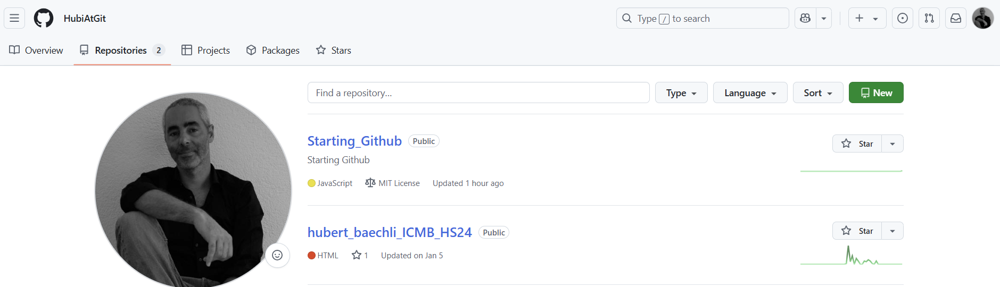
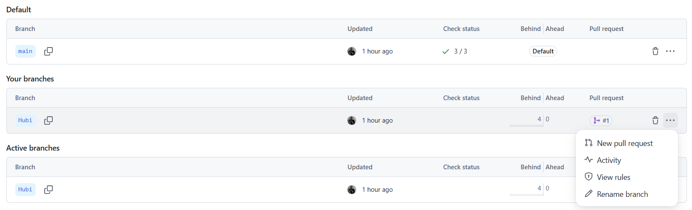
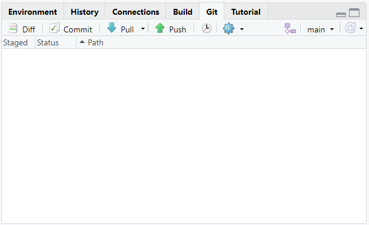

# Starting_Github

To get familiar with how GitHub works, we believe the best approach is simply to explore and try things out. So, here’s a small list of tasks to help you get started and understand GitHub’s core functionality:

If I’ve already added you as a collaborator, you should now see the project called **Starting_Github**.

1.  **Clone** the project to your local computer. <https://github.com/HubiAtGit/Starting_Github.git>

2.  Create your **own branch** (for example, named after yourself) and **switch** to that branch.

3.  Open the file `template.qmd` located in the **Classmates** folder.

4.  **Save** this file under the name of your GitHub account.

5.  Change the **header** of the file and save it again.

6.  Open your terminal and type: `quarto preview`

7.  If everything looks good, **stage**, **commit**, and **push** your changes.

8.  Your new file should now be on GitHub—but it will only be visible in **your branch**!

9.  Go to GitHub and **create a pull request** to merge your file into the **main branch**.

To guide you through this process, you can either follow the tutorial at <https://happygitwithr.com/> — or just play around! Nothing bad will happen 😊

**Note:** After cloning the project to your local drive, you can do all the steps (except step 9) directly from within the RStudio window.

